# WeUI-Compose

使用 Compose Multiplatform 实现的 [WeUI](https://github.com/Tencent/weui) 设计规范及组件

*尚未开发完成*

# Desktop

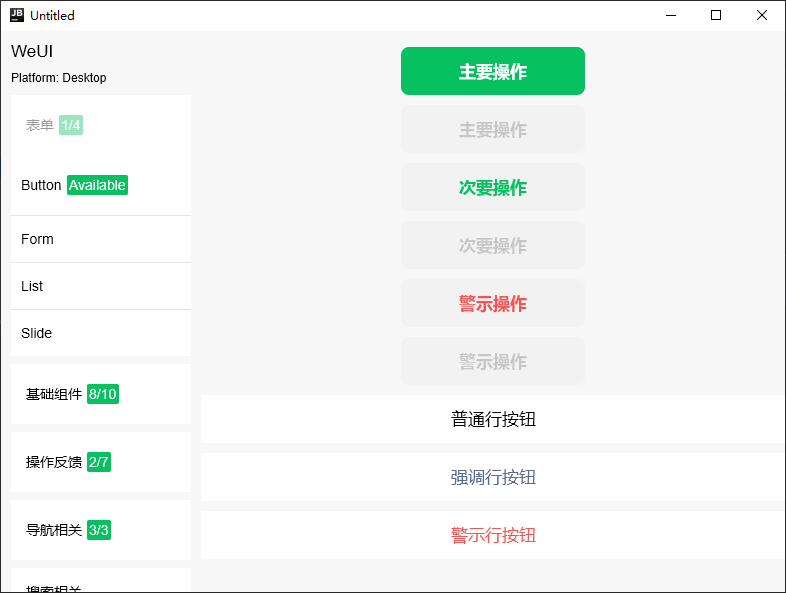
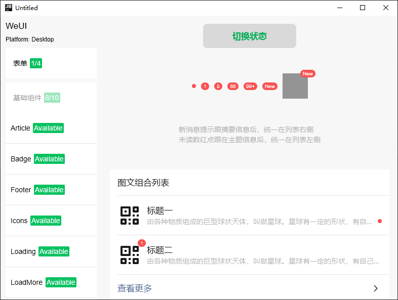
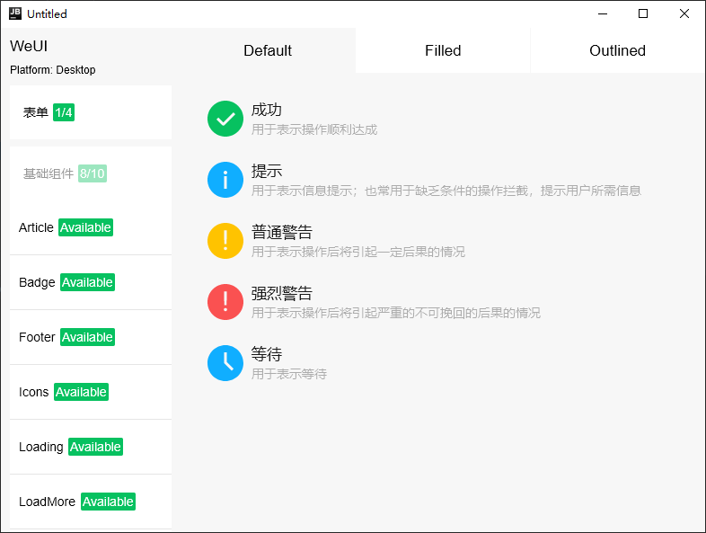
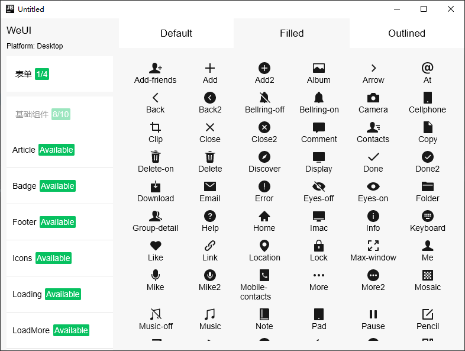
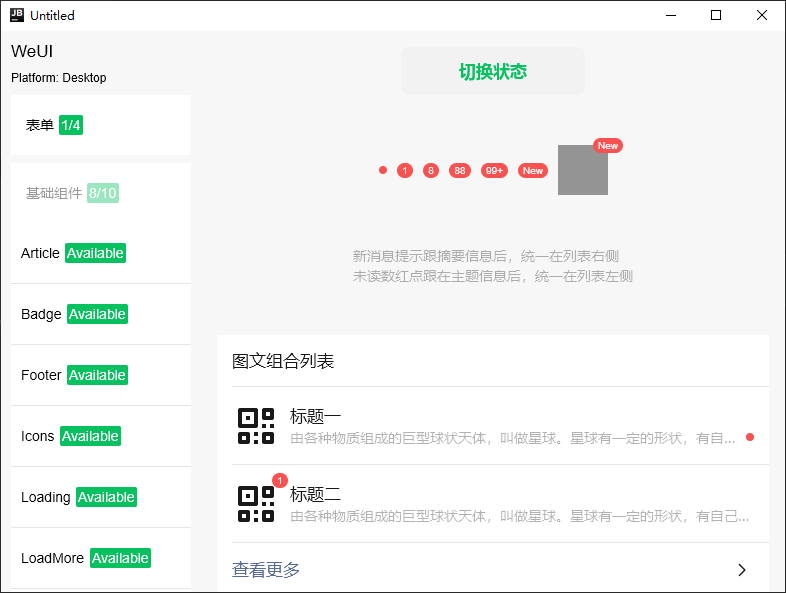
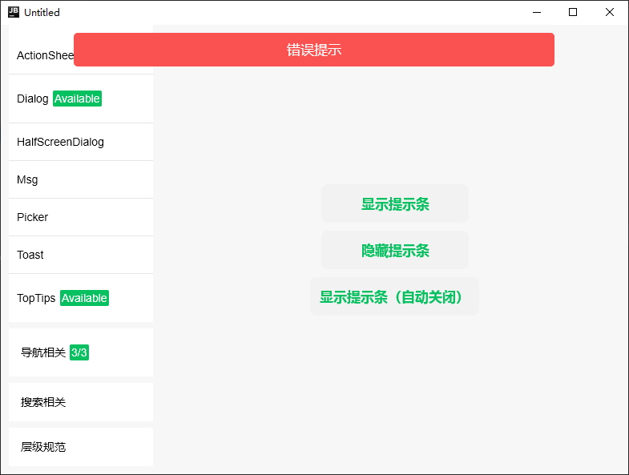
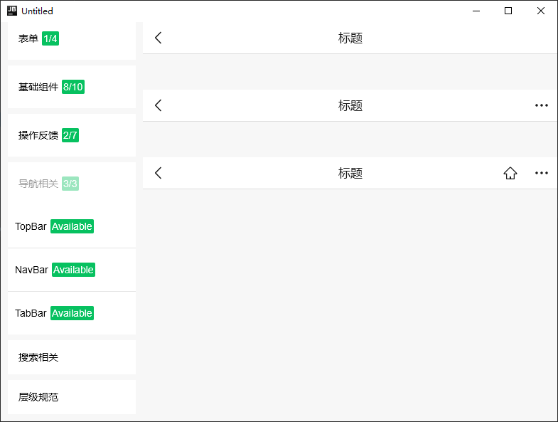
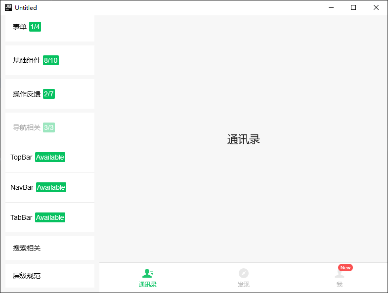
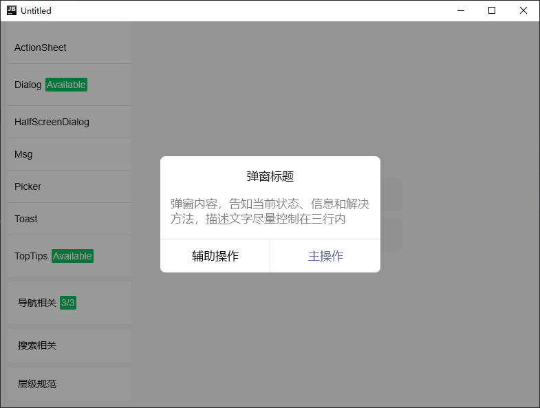
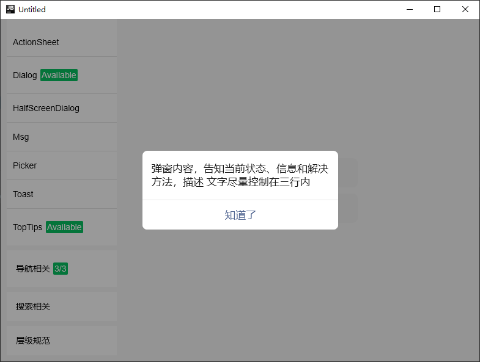

# Android

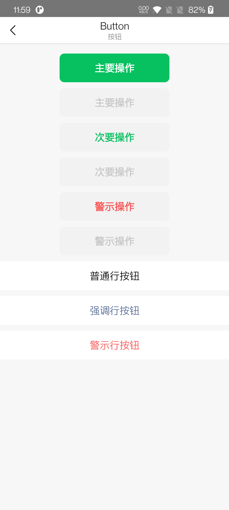
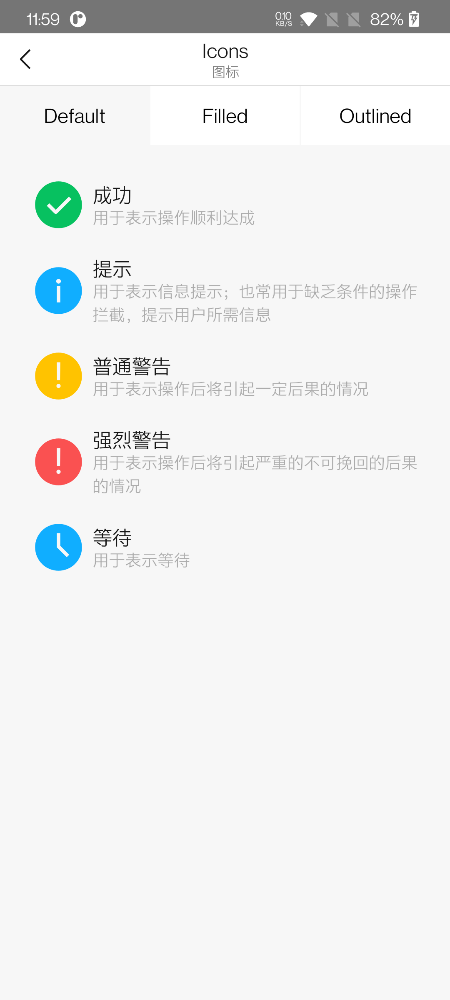
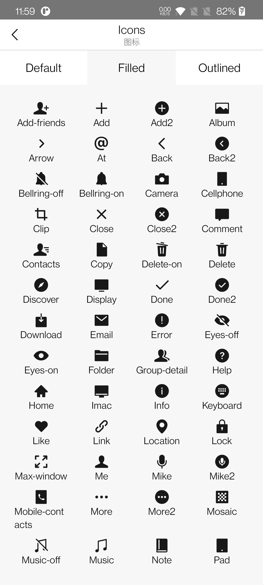
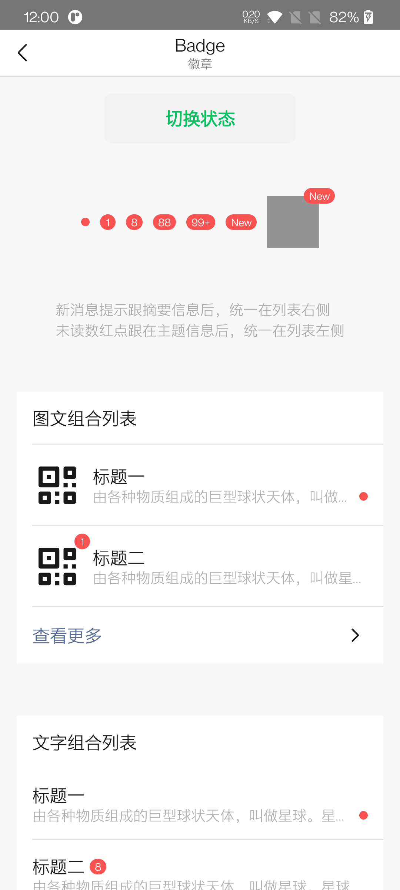

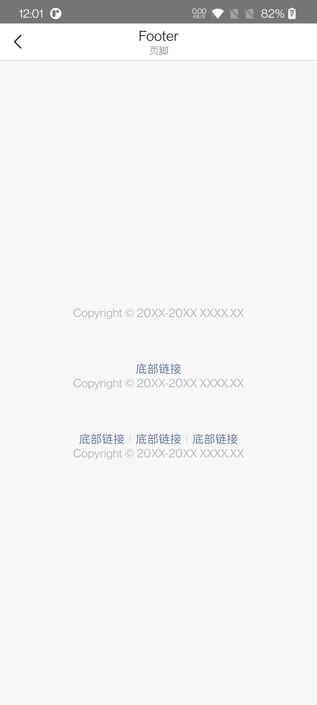

# Thanks

[Compose Multiplatform](https://github.com/JetBrains/compose-jb)
跨平台的 Compose 实现，提供了 Windows、macOs、Linux 端的 Compose 框架
[svg-to-compose](https://github1s.com/DevSrSouza/svg-to-compose)
将 Svg 文件转换为 Compose 中的 ImageVector